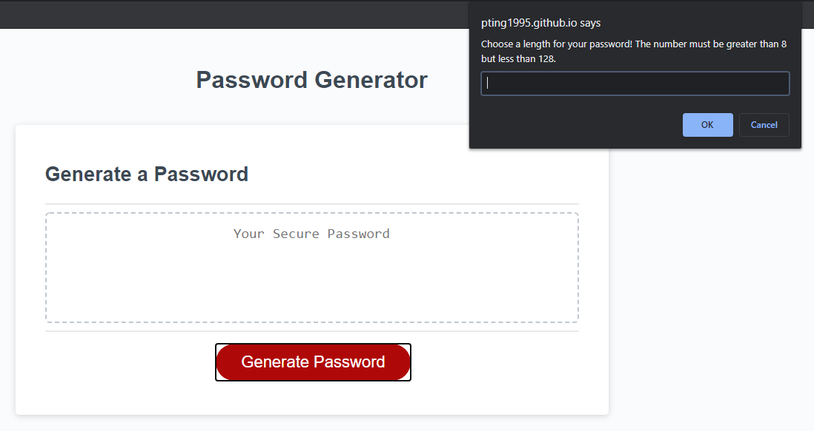

# Random Password Project



This site was made to create random passwords! Upon clicking the "Generate Password" button prompts will appear and ask the user the desired criteria for the password. Criteria include character types, such as lower case characters, upper case characters, numeric characters special characters, and also password length. If a length shorter than 8 or larger than 126 is entered into the password length then the user will have to restart. If there is a number entered between 8 and 126 but no characters are selected then a prompt will appear requesting you pick at least one character type. All desired characters are added to a control array where a random number is selected between 1 and the total number of items in the control array. This will occur until the desired password length is achieved and then will be displayed in the text box.

## Snips of code

Pseudocoding and planning ahead made this project much more straightforward than I initially thought. The following code snippet is the logic to decide if numberic characters should be included in the password and then adds that array into the control array. This was done for all of the character types.

```
numbericPass = confirm("Do you want numberic characters?There are " + numArr.length + " numeric characters.")
    if (numbericPass === true) {
      // add numbers to controlarr
      controlArr = controlArr.concat(numArr)
    }
```

Once all of the desired critera was added, this random number generator was used to pick a number between 1 and the total number of items in the control array.

```
function rngGen() {
    return Math.floor(Math.random() * controlArr.length)
  }
```

The random number was then put inside this loop to select the corresponding value in the control array and the password would be produced.

```
for (i = 0; i < passLength; i++) {
      var randomNum = rngGen();
      var randChar = controlArr[randomNum];
      pwOut = pwOut + randChar
    }
```

## Built With

* [HTML](https://developer.mozilla.org/en-US/docs/Web/HTML)
* [CSS](https://developer.mozilla.org/en-US/docs/Web/CSS)
* [JS](https://www.javascript.com/)
* [GitHub](https://github.com/)
* [Git](https://git-scm.com/)

## Deployed Link

* [See Live Site](https://pting1995.github.io/password-generator/)

## Authors

* Peter Ting

- [Link to Github](https://github.com/Pting1995)
- [Link to LinkedIn](https://www.linkedin.com/in/pting002/)

## License

This project is licensed under the MIT License 

## Acknowledgments

* Thank you to UC Berkeley's Extension Bootcamp for giving me the opportunity to work on this project!
* Thank you Coleman Buffa for helping me pseudocode this project!